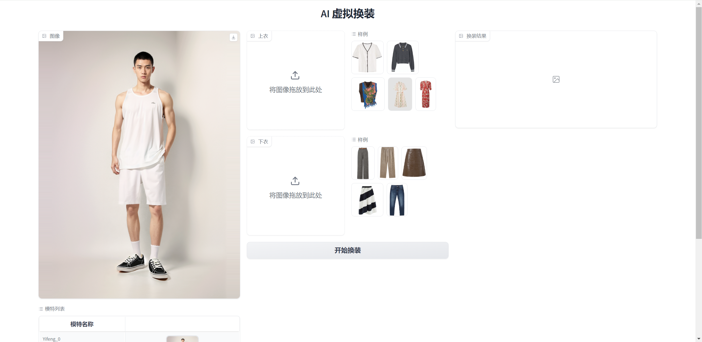
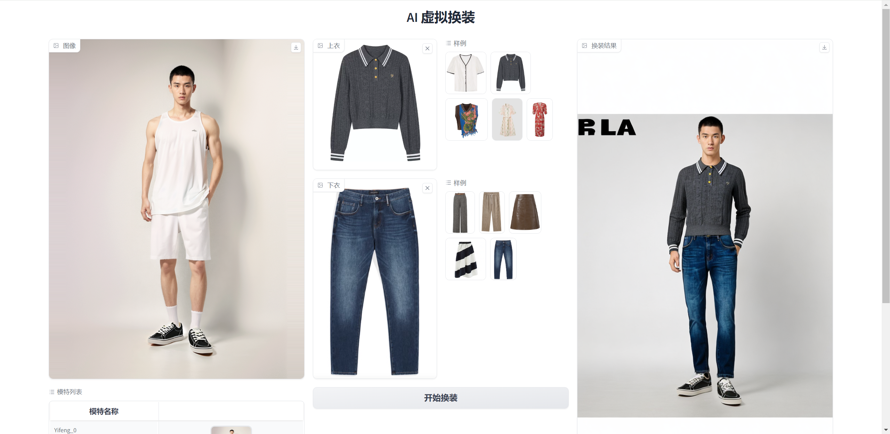
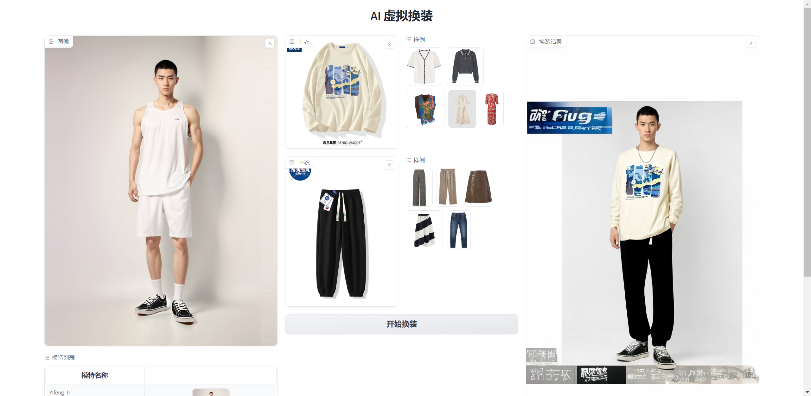

# 虚拟换装


## 安装步骤


克隆仓库

```
git clone https://github.com/lbz2020/OutfitAnyoneAPI.git
cd ./OutfitAnyoneAPI
```

下载依赖

```
conda create -n OutfitAnyoneAPI python=3.8
conda activate OutfitAnyoneAPI
pip install opencv-python gradio==4.9.1 -i https://pypi.tuna.tsinghua.edu.cn/simple
```

运行

```
python app.py
```

网页输入**127.0.0.1:7860**即可体验





